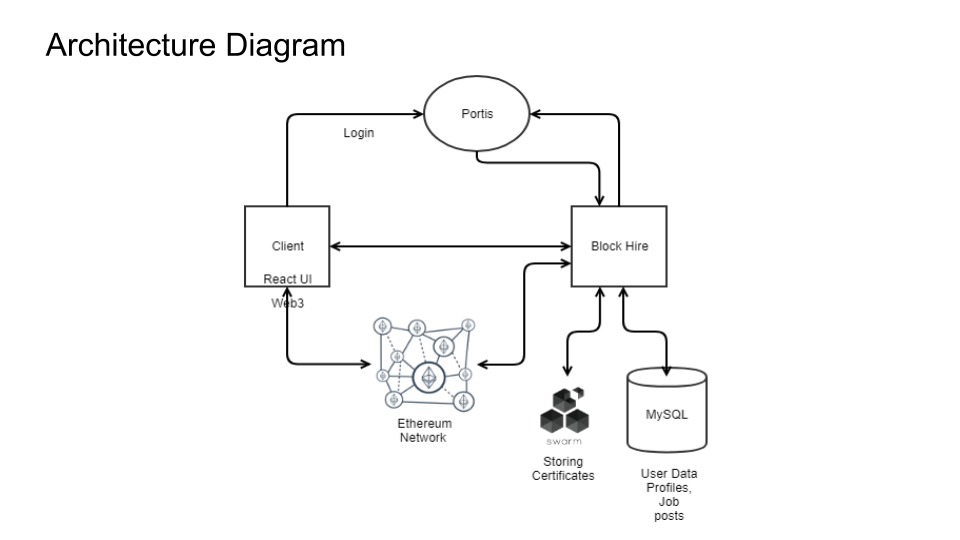

# Geth-Hired

### Purpose

The main purpose of the product is to help individuals to make their professional profile to showcase their education, achievements, experiences where each certificate can be validated to prove their genuineness from respective organizations.
The other aspect of this product is to provide companies/recruiters a platform where they can post their jobs and get the most authentic, legitimate, valid candidates suited as per their requirements in easier, faster and cost-effective ways.     

### Product Scope

- Easy profile building where anyone can showcase their true achievements with proper validation credential from certificate respective authorities and easy verification of certificates.
- To provide a platform for job searching, job applying in more secure transparent while considering candidate privacy.
- For recruiters to post jobs easily and come across verified genuine legitimate candidates.
- Incentives for certificate issuer/ validators of certificate on validate certificates and store signature credentials then in most secure, reliable, immutable way.
- The main feature which makes it different from other job portal is that recruiters can verify shortlisted candidates in just one click as the certificates are verified beforehand from their respective authority. 
- User has control over his/her sensitive data like contact information, avoiding the misuse of user information.

### Product Functions

- There are two primary roles present in the system - a job seeker, validator/recruiter. The transactions happen in the form of tokens on the system.
- Candidate is onboarded on the platform and rewarded tokens on registering.
- The certificates and achievements uploaded are then requested for validation by The secondary roles being the validator, recruiter, administrator.the candidate which consumes tokens. 
- The administrator forwards these requests to authentic authorities for signing. (This can be done on-chain or off-application but in this release it is on-application)   
- The validators sign and rewarded with tokens. They can either sign or reject the incoming request. The status is stored on the database. 
- After validating all the uploaded certificates, a candidate is eligible to apply for the job. 
- Companies/recruiters post the jobs and get a listing of validated profiles. 
- They can verify these profiles on the blockchain. 

### Architecture Diagram


## Tech Stack

- Solidity 0.5.x | Smart contracts
- Truffle | IDE
- Remix | IDE
- Ropsten | Blockchain test network
- Infura | deployment keys
- Swarm | distributed storage
- MySQL 
- Portis | Handling ethereum wallet 
- Web3 (commonly called web3.js)
- Node.js
- React (react.js) 


## Setup

### Deploy Smart Contracts

- Open [Remix-IDE](http://remix.ethereum.org).

- Copy all the smart contracts from the Smart-Contract repository and save them with the same name in the editor.

  `git clone https://github.com/fossee-ethera/Smart-Contracts.git`

- Now, compile [ExampleToken.sol](https://github.com/fossee-ethera/Smart-Contracts/blob/master/ExampleToken.sol) and [Escrow.sol](https://github.com/fossee-ethera/Smart-Contracts/blob/master/Escrow.sol)

- First deploy ExampleToken.sol on Injected Web3 (Ropsten Test Network) and then copy contract address generated. Then, deploy Escrow.sol by pasting this contract address of ExampleToken.sol.

- Copy the ABI, contract addresses of ExampleToken.sol in [Abis.js](https://github.com/fossee-ethera/Geth-Hired-UI/blob/master/src/components/Abis.js) and of Escrow.sol in [Abis2.js](https://github.com/fossee-ethera/Geth-Hired-UI/blob/master/src/components/Abis2.js)

## Running Geth-Hired

   Now clone the [Geth-Hired-UI](https://github.com/fossee-ethera/Geth-Hired-UI) repository.
   
  `https://github.com/fossee-ethera/Geth-Hired-UI.git`
  
  `cd Geth-Hired-UI`
  
### Install Dependencies

   `npm install` or `sudo npm install`
   
   These dependencies can be found in [package.json](https://github.com/fossee-ethera/Geth-Hired-UI/blob/master/package.json)

### Setting up MySQL database

- Import the [database.sql](https://github.com/fossee-ethera/Geth-Hired-UI/blob/master/database.sql) file to create SQL database or just paste contents on your mysql terminal. 

  `mysqldump --databases gethdb > database.sql`
  
  `gethdb` is the name of the database. 
  
- Edit connection in [Server.js](https://github.com/fossee-ethera/Geth-Hired-UI/blob/master/Server.js)
  
  ```javascript
  const connection = mysql.createConnection({
  host: "localhost",
  user: "root",
  password: "mysql",
  database: "gethdb" });
  ```

- Run the Server.js file

  `node Server.js`
  
### [Admin-Page](https://github.com/fossee-ethera/Admin-Page) Setup

  `git clone https://github.com/fossee-ethera/Admin-Page.git`
  
  `cd Admin-Page`
  
### Run both the repositories using

  `npm start`


This project was bootstrapped with [Create React App](https://github.com/facebook/create-react-app).

## Available Scripts

In the project directory, you can run:

### `npm start`

Runs the app in the development mode.<br>
Open [http://localhost:3000](http://localhost:3000) to view it in the browser.

The page will reload if you make edits.<br>
You will also see any lint errors in the console.

### `npm test`

Launches the test runner in the interactive watch mode.<br>
See the section about [running tests](https://facebook.github.io/create-react-app/docs/running-tests) for more information.

### `npm run build`

Builds the app for production to the `build` folder.<br>
It correctly bundles React in production mode and optimizes the build for the best performance.

The build is minified and the filenames include the hashes.<br>
Your app is ready to be deployed!

See the section about [deployment](https://facebook.github.io/create-react-app/docs/deployment) for more information.

### `npm run eject`

**Note: this is a one-way operation. Once you `eject`, you can’t go back!**

If you aren’t satisfied with the build tool and configuration choices, you can `eject` at any time. This command will remove the single build dependency from your project.

Instead, it will copy all the configuration files and the transitive dependencies (Webpack, Babel, ESLint, etc) right into your project so you have full control over them. All of the commands except `eject` will still work, but they will point to the copied scripts so you can tweak them. At this point you’re on your own.

You don’t have to ever use `eject`. The curated feature set is suitable for small and middle deployments, and you shouldn’t feel obligated to use this feature. However we understand that this tool wouldn’t be useful if you couldn’t customize it when you are ready for it.

### Developers
* Abhishek Kedia 
* Akshat Jain
* Divyajyoti Ukirde 
* Siddharth Chaki 
* Vindeep Chaudhari 

### Tech Lead
Mr. Parag Tiwari
